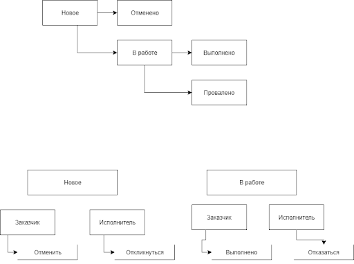

### О проекте
«TaskForce» — это онлайн площадка для поиска исполнителей на разовые задачи. Сайт функционирует как биржа объявлений, где заказчики — физические лица публикуют задания. Исполнители могут откликаться на эти задания, предлагая свои услуги и стоимость работ.

### Основные сценарии использования сайта
 - Публикация задания  
 - Добавление отклика на задание  
 - Поиск заданий по категориям и названию  
 - Выбор исполнителя и назначение его на задание  
 - Редактирование профиля  

### Список статусов и переходов

Задание может находиться в одном из пяти статусов. Доступные действия над заданием зависят от текущего статуса. Ниже предлагается перечень из всех доступных статусов, возможные переходы между ними и доступные действия на каждом из этапов.

```
Новое     - Задание опубликовано, исполнитель ещё не найден  
Отменено  - Заказчик отменил задание  
В работе  - Заказчик выбрал исполнителя для задания  
Выполнено - Заказчик отметил задание как выполненное  
Провалено - Исполнитель отказался от выполнения задания 
```
 

### Список всех страниц
 - Лендинг
 - Регистрация аккаунта
 - Вход на сайт
 - Список заданий
 - Добавление задания
 - Просмотр задания
 - Профиль пользователя
 - Настройки аккаунта
 - Мои задания
 - Модальные окна

### Лендинг
Эта страница почти целиком состоит из статического контента.

### Регистрация аккаунта
Чтобы пользователь имел возможность добавить на сайт своё задание, либо откликнуться на чужое, ему необходимо пройти процедуру регистрации.

### Вход на сайт
Страница должна быть доступна только анонимным пользователям. Если на эту страницу попал залогиненный пользователь, то его следует перенаправить.

### Список заданий

Эта страница нужна для показа всех доступных на сайте заданий.
Состоит из двух блоков: карточки задания слева и блок фильтров справа.

Список заданий включает только задания в статусе «Новое». Показываются только задания без привязки к адресу, а также задания из города текущего пользователя.

Время публикации задания выводится в относительном формате вида «минут/часов/дней назад» с округлением в меньшую сторону.

При большем числе записей следует показывать их через пагинацию.

### Добавление задания
Страница для публикации на сайт нового задания. Эта страница доступна только пользователям с ролью «Заказчик».  

### Просмотр задания
Основные функции этой страницы:
- Просмотр информации задания
- Добавление отклика
- Управление статусом задания
- Выбор исполнителя
- Добавление отзыва об исполнителе

### Профиль пользователя
Страница для показа подробной информации об исполнителе.

На странице имеется рейтинг пользователя.  
Считается по формуле: `сумма всех оценок из отзывов / (кол-во отзывов + счетчик проваленных заданий).`

### Настройки аккаунта

На этой странице пользователь может поменять информацию своего профиля, загрузить/изменить аватар, выбрать свои специализации.  

### Мои задания

Здесь показаны карточки заданий, в которых принимал участие пользователь.
Страница выглядит по разному для роли «Заказчик» и «Исполнитель».

- Заказчик

Назначение этой страницы — показать все задания, которые создавал этот пользователь.
Меню в левой части страницы отвечает за фильтрацию заданий, в зависимости от их статуса:

«Новые» — опубликованные задания, на которые не выбран исполнитель
«В процессе» — задания, которые сейчас находятся в процессе выполнения
«Закрытые» — задания в статусах «Отменено», «Выполнено», «Провалено»  


- Исполнитель

Назначение этой страницы — показать все задания, на которые откликался этот пользователь.
Меню в левой части страницы отвечает за фильтрацию заданий, в зависимости от их статуса:

«В процессе» — задания, которые сейчас находятся в процессе выполнения
«Просрочено» — задания в процессе выполнения, но с истекшим сроком
«Закрытые» — задания в статусах «Выполнено» и «Провалено»

### Роли пользователей

Анонимные пользователи имеют доступ только к лендингу, страницам регистрации и входа на сайт.

Пользователи, прошедшие регистрацию и вошедшие на сайт, видят все страницы, доступные для своей роли, кроме страницы регистрации и страницы входа.

Зарегистрированный пользователь может принадлежать одной из двух ролей: Исполнитель или Заказчик. Роль выбирается в процессе регистрации и не может быть изменена позднее.

Заказчики могут публиковать новые задания. Пользователю с ролью «Исполнитель» доступ к странице создания задания должен быть закрыт.

Исполнители могут откликаться на задания, в то время как заказчикам эта возможность закрыта.

---
```sh
artisan migrate
npm install
npm run build
artisan storage:link
```
